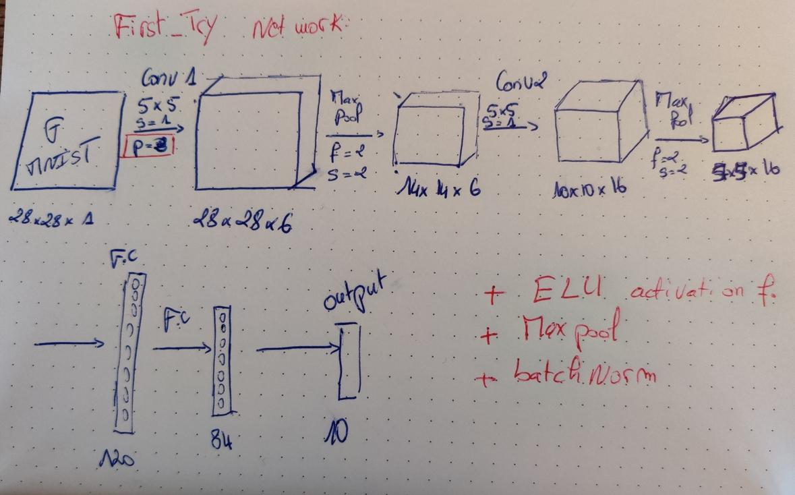
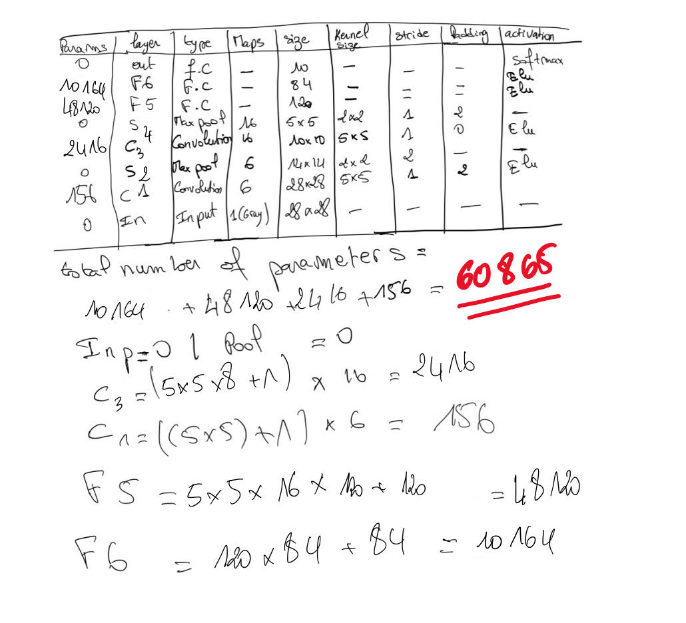
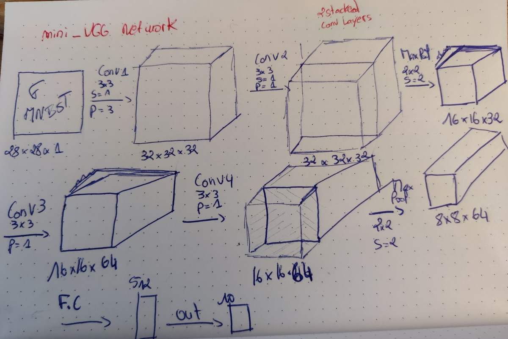
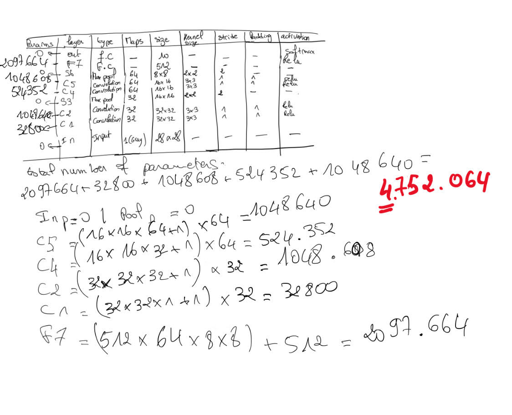
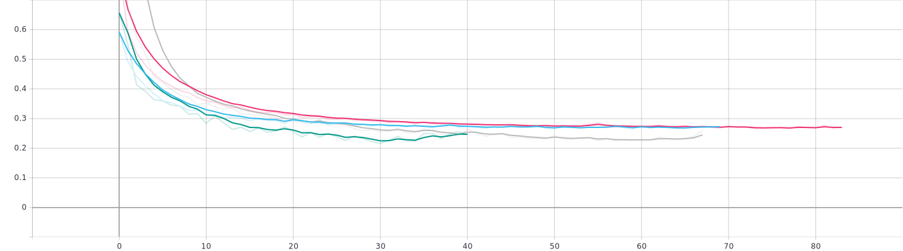
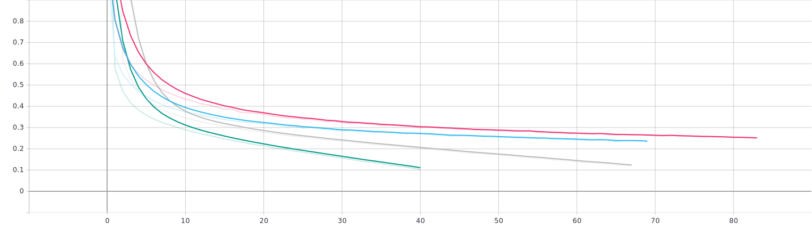
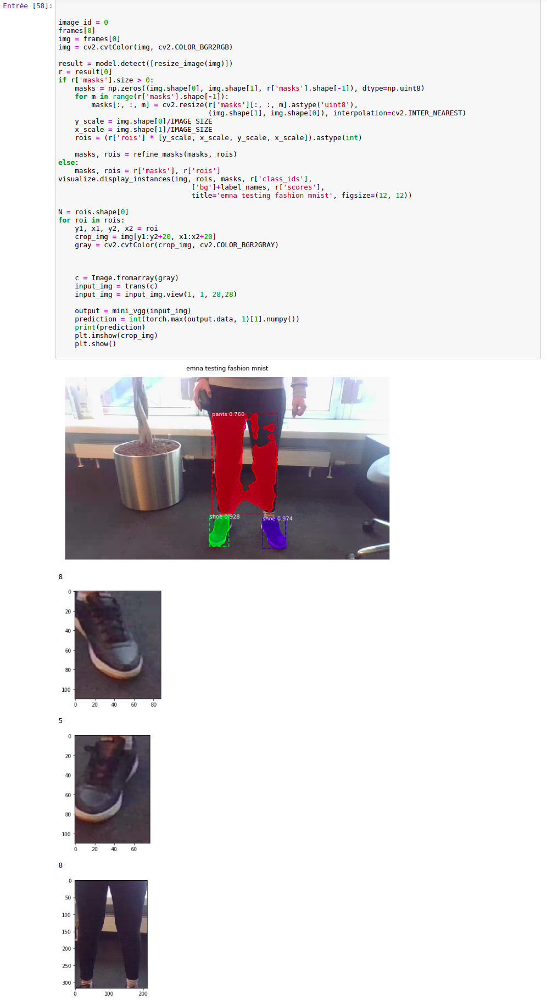

# Experiment 
CNN are a common use for image classification tasks. There is plenty of networks that could do it like Resnet, VGG, Alexnet, Lenet, etc..  
In this experiment i decided to try two networks. 
- [LeNet-5](http://yann.lecun.com/exdb/publis/pdf/lecun-01a.pdf): which is one of the very first convolutional neural networks. I chose this network because it has few parameters (60k) and the network is not big(5layers).
Also LeNet-5 input image is 32*32 which is very close to my input images.
- [VGG](https://arxiv.org/pdf/1409.1556.pdf): VGG is is one of the most used image-recognition architectures, so it could easily solve my problem. But Default Network has an input image of 224*224 and usually 16 or 19 layers which is impossible to apply on my dataset. Then i had the idea to come with mini_vgg network based on VGG.
### Lenet-5 based network
I have introduced a few changes to the original network, so the model can fit my data  (28*28 images):
- A batch normalization layer added after each convolutional layer
- Elu activation function(The original LeNet architecture used TANH activation functions rather than ELU) 
 ◦ ELU has nonlinearity and linearity at the same time.
 ◦ No “dying ReLU” problem.
- MaxPool instead of AvgPool 
- padding added to conv1 to prevent the image from being shrinked   
This model we will be having 2 Conv2D layers with 6 and 16 filters each followed by a Max Polling layer of size 2 x 2 Using Eelu activation function.  
We also add a dropout regularization layer with ratio 0.5 to prevent any overfitting.
  Together with the dropout I used early stopping technique with a patience interval of 10, which means that after 10 epochs if validation loss is increasing(did not decrease), I stop the training and keep last saved weights 
Finally the model has a softmax layer with the 10 required classes as output.

#### Discussion on Learnable Layers of CNN5 Network (LeNet-5 based)
A convolution neural net tries to learn the values of filter using backpropagation, which means if a layer has weight matrices, it is called a “learnable” layer.  
The number of parameters in a given layer is the count of “learnable” elements for a filter for that layer. 
As we can see in the figure, only conv layers and fully connected layers are learnable layers.  
The input layer , the pooling layers and the output have 0 learnable parameters. 

  
This network contains `60865` parameters almost same as LeNet-5 
### mini_VGG network
The second model is based on VGG network, the idea behind it is to stack convolutional neural networks with using a bigger number of filters. 
In this network, i used 4 convolutional layers, together with max pooling layers and Relu as an activation function. 
This time i used a 512 dense layer .

### Discussion on mini_VGG Learnable parameters
As we can see in the figure, this network contains much more parameters then the first model, around `4.8M parameters`, which has made the training slower than the first model.
 

 
In this section, i will try to benchmark between the 4 models we have. As we can see in this table, the model accuracy for all the models is under 90%.
  mini_vgg with a batch_size=64 is the winning model with an accuracy 0f `92.2%`

## Benchmarking
I set the training epochs to 150. Used Early stopping techniques to prevent training while model starts overfitting. 
As we can see in the table, the training time of each model(experiment), the accuracy  and the number of epochs during which the model was training.
Also you can see diffirent used parameters when training the model.

| model | Accuracy | Training time (s) | Epochs |
| --- | --- | --- | --- |
| CNN5 (lr=0.001, batch_size=64, shuffle=False) | 0.907 | 542| 83|
| CNN5 (lr=0.001, batch_size=128, shuffle=False) | 0.908 | 592| 69 |
| mini_vgg (lr=0.001, batch_size=64, shuffle=False)| 0.922  | 755| 67 |
| mini_vgg (lr=0.001, batch_size=18, shuffle=False)| 0.921| 1152| 40 |

  CNN5 (lr=0.001, batch_size=64, shuffle=False)  
 CNN5 (lr=0.001, batch_size=128, shuffle=False) 
 mini_vgg (lr=0.001, batch_size=64, shuffle=False) 
mini_vgg (lr=0.001, batch_size=128, shuffle=False) 

### Test loss
 
### Train loss
 
### Accuracy
 

As the figures show the green model is the best  (lr=0.001, batch_size=64, shuffle=False)  
But, when it comes to selecting the best model, it depends on several factors. Here the difference of accuracy between CNN5 and mini_vgg is almost  `0.02`. 
But the is a big difference when we have a look into the training time (almost `4min`). So selecting the model really depends on requirements and use case.
## Improving the model by more hyper tuning
Due to limited resources/time, i only set few parameters for hyperparameter tuning.  
We could improve this by adding more values to 
- learning rate [`1e-3`, `1e-2`, `1e-4`, `1e-1`]
- shuffle [`True`, `False`] : was only set to false
- patience [`10`, `15`, `20`]: earlystopping parameter, set to 10 in our experiment.
- ....

# Apply model on real world images:
So i wrote a code to make image segmentation by fashion item and tried to apply a model from a  
[kaggle notebook](https://www.kaggle.com/pednoi/training-mask-r-cnn-to-be-a-fashionista-lb-0-07) which helped identify `ROI` regions (region of interest).  
As you can see in the figure, even if the mask is not very accurate, the bounding boxes will cover most of it. So the model it self is fine to make fashion item segmentation(not all classes. `ex: no shirts/t-shirts ..`) 

 
I tried to apply one of my models on these rois but the model did not give accurate results and i thin it is because Fashion mnist dataset is a special dataset with black background.  
 Generally it is unreasonable to expect the model to work well on data that is different from what it is has been trained on, but If we want to apply this models on real world images, we need to process our images/frames the same way as Fashion Mnist dataset is processed. and even though, it might not generalize on this processed data.  
   In this experiment mini_vgg gave the better results, we could retrain our network with real world images and then apply it video frames/images.
  
 `NB`: `Please do not use my shoes or my trouser any where in the internet without buying a licence :)`
 
 ## Next Step
 The next step will be to try to preprocess the data the same as Fashion Mnist is processed and try to apply the model on processed rois. 
