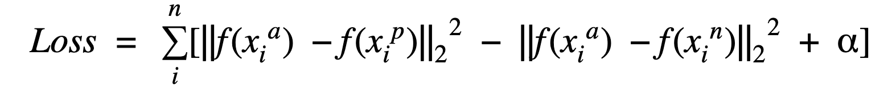
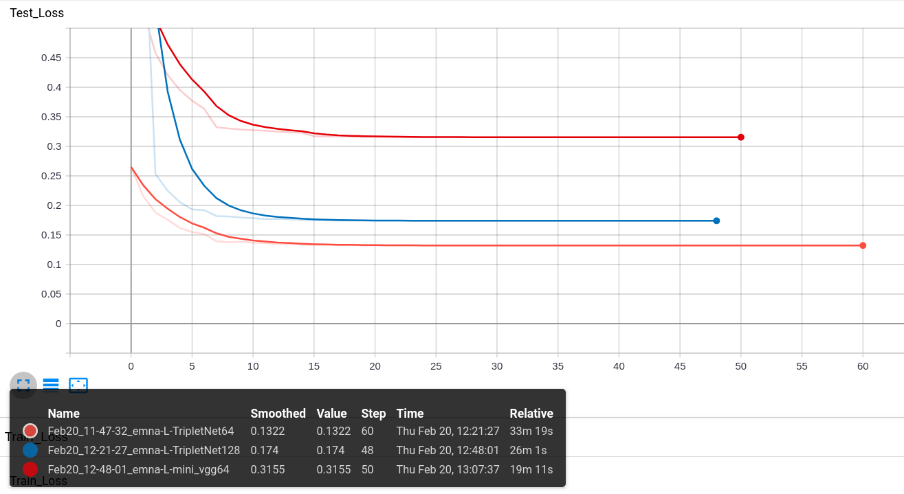

# Triplet Loos 
In this release we added the triplet loss. We will train the network using 2 diffirent losses which are Cross Entropy Loss and Triplet Loss, with keeping the hyperparameter tuning part.
To train such a triplet network, Consider a triplet — [anchor, positive, negative] (see image). Triplet loss is defined w.r.t these three images as follows —
 
  
- Define distance metric d = L2 norm
- Compute the distance between embeddings of anchor image and the positive image = d(a, p)
- Compute the distance between embeddings of anchor image and the negative image = d(a, n)
- Triplet loss = d(a, p) — d(a, n) + offset
### Mathematical representation of triplet loss
  
**Here, x^a -> anchor, x^p -> positive and x^n -> negative**  

_**Source: Schroff, Florian, Dmitry Kalenichenko, and James Philbin. Facenet: A unified embedding for face recognition and clustering. CVPR 2015._**

## Steps to apply Triplet Loss
- Create a dataset returning triplets - CustomDatasetFromArrays class from dataset.py, check if `triplet=True`
- Define embedding (mapping) network $f(x)$ - EmbeddingNet from models.py
- Define triplet network processing triplets - TripletNet wrapping EmbeddingNet in models.py
- Train the network with TripletLoss in triplet/losses.py

## Results
Here is some overview about training rsults. In this figure we can see the training results of 2 networks: tripletNet with batch size 64 and 128 and miniVGG network with batch size 64.  
As we can see here the Triplet network achieved the best loss on the vaidation set equal to `0.1322`.
I did not train all networks or tune all parameters but as shown triplet loss is a good loss to classify fashion mnist data.  

